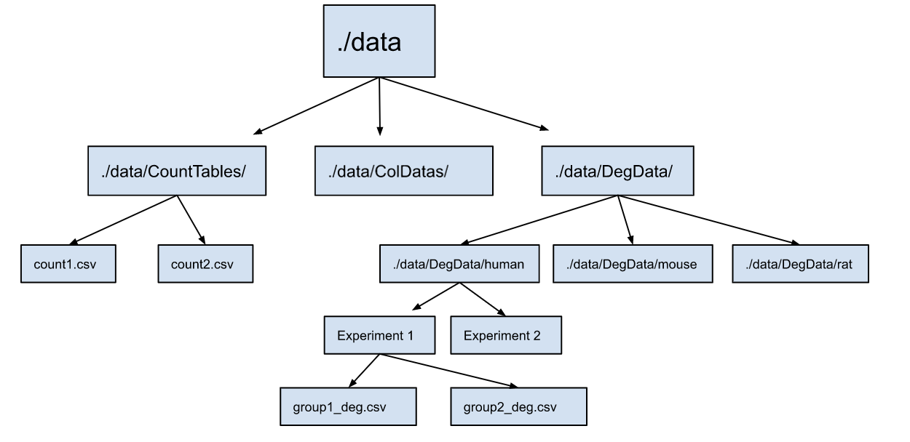

# Data Processing {#data}
```{r, include = TRUE, message=FALSE, echo=FALSE}
knitr::opts_chunk$set(echo = TRUE)
```

<style>
img
{
    display:block;
    float:none;
    margin-left:auto;
    margin-right:auto;
}
</style>


1. Prepare data tables (minimum: count matrix, column data)
2. Compile all data into an `.RData` or `.db` object.

---

## Preparation

```{r, echo=FALSE}
## requirements for examples
# load libraries
library(dplyr)
library(tidyr)
library(RSQLite)
library(stringr)
library(kableExtra)
library(ggplot2)
library(ggrepel)

# load data
count   = read.csv("./data/CountTables/TPM_mouse.csv", header = TRUE)
colData = read.csv(paste0("./data/colData/", "TPM_mouse_colData.csv"), header = TRUE)
deg     = read.csv(paste("./data/DegData/b10d2.csv", sep=""), header = TRUE, row.names = 1)
```

To implement this app, you will need three types of data:

1. Count tables in `./data/CountTables/` folder  

```{r, message=FALSE , echo=FALSE}
kbl(count %>% head) %>% kable_styling(bootstrap_options = c("striped", "hover", "condensed", "responsive"), font_size = 12, latex_options = "scale_down") %>% scroll_box(width = "100%", height = "250px")

```
&nbsp;


2. Column Data (abbrev: `colData`) in `./data/ColDatas/` folder
  * This contains the info about each sample
  * The colnames of `colData` should include `Population`, `Timepoint`, `Sex`, `Dataset`, and `Species`
  * If your experiment does not separate those samples based on any of those parameters, you will need to create a column that specifies this. E.g. if your samples are of mixed sex, you can creates a `Sex` column containing ‘mixed’ for all samples.  
  
```{r , echo=FALSE}
kbl(colData %>% head) %>% kable_styling(bootstrap_options = c("striped", "hover", "condensed", "responsive"), font_size = 12, latex_options = "scale_down") %>% scroll_box(width = "100%", height = "400px")
```
&nbsp;


3. Differential expression data frames (abbrev: `deg_df`) in `./data/DegData/` folder  
  * This data file contains the _log2FoldChange_ and statistics of one case vs control 
  * An experiment can have multiple `deg_df` files
  
```{r, echo=FALSE}
kbl(deg %>% head) %>% kable_styling(bootstrap_options = c("striped", "hover", "condensed", "responsive"), font_size = 12, latex_options = "scale_down") %>% scroll_box(width = "100%", height = "250px")
```


## Species _(optional)_

If your data contains different species, you will also need datasets that allow you map gene symbols/IDs between species. We have provided an option using the `biomaRt` library. 

```{r, message=FALSE, results = FALSE}
library("biomaRt")
mouse = useMart("ensembl", dataset = "mmusculus_gene_ensembl", verbose = TRUE, host = "https://dec2021.archive.ensembl.org")
human = useMart("ensembl", dataset = "hsapiens_gene_ensembl", verbose = TRUE, host = "https://dec2021.archive.ensembl.org")

geneV1 = getLDS(attributes = c("mgi_symbol","ensembl_gene_id"), 
                filters = "ensembl_gene_id", 
                values = count$X, 
                mart = mouse, 
                attributesL = c("hgnc_symbol", "ensembl_gene_id", "description"), 
                martL = human, 
                uniqueRows=T)

colnames(geneV1) = c("mgi_symbol", "mouse_gene_id", "hgnc_symbol", "human_gene_id")
```

```{r, echo=FALSE}
kbl(geneV1 %>% head) %>% kable_styling(bootstrap_options = c("striped", "hover", "condensed", "responsive"), font_size = 12, latex_options = "scale_down") %>% scroll_box(width = "100%", height = "450px")
```

## RData _(option 1)_
You can store data frames into .RData using the `save()` function. For example, we can use the save() function to save the `count` data frame to a file called `my_data.RData`. 

```{r}
save(count, file = "my_data.RData")
```

To load the data frame from the `.RData` file later, you can use the `load()` function in your server. Y
```{r}
load("my_data.RData") # add to server
```

*NOTE*, some functions will need to be modified to read from a `.RData` instead. This can be done by uncommentng the relevant lines of code. For example:


```{r, eval=FALSE}
  shiny::observeEvent(input$load, {
    
    if (include_count == TRUE){
      # query count datasets
      
      ## comment here for .RData file
      # for database 
      {
        if (species == "human") {
          sql = paste("SELECT * FROM", count_df, "WHERE mgi_symbol = ?")
        }
        else{
          sql = paste("SELECT * FROM", count_df, "WHERE symbol = ?")
        }
        filt = RSQLite::dbGetPreparedQuery(conn, sql, bind.data=data.frame(symbol=genes()))
        filt = as.data.frame(filt)
      }
     
      ## uncomment here for .RData file
      # using R Data 
      {
        # if (species == "human"){
        #   filt = count_df[count_df$mgi_symbol %in% genes(),]
        #   X = rownames(filt)
        #   filt = cbind(X, filt)
        #   
        # }
        # else {
        #   filt = count_df[count_df$symbol %in% genes(),]
        #   X = rownames(filt)
        #   filt = cbind(X, filt)
        # }
      }
```

If you plan to store data this way, move to the *User Interface* section now. If you are working with larger amounts of data, you may find it useful to set up an SQL database (_recommended_, below).

## Building an SQL database via R _(recommended)_

While `.RData` files can be useful small or medium-sized datasets in R, SQL databases provide a more powerful and flexible solution for managing large, complex datasets that need to be shared, queried, and analyzed by multiple users or integrated with other tools and applications.

An SQLite database consists of one or more tables, which are composed of rows and columns. An RSQLite `.db` object is a database connection to a SQLite database file through R. The following functions will be useful in creating and updating the `.db` object in R. 

Here, we provide an overview for bulk count data. `Seurat` objects (for sc/snRNA-seq or ATAC-seq) are read in separately.

```{r}
# This function connects to a SQLite database file called `example_database.db`
db_dir = "example_database.db" 
conn  <- dbConnect(RSQLite::SQLite(), db_dir)
```

```{r, eval = FALSE}
# This function stores dataframe objects into `.db` object 
dbWriteTable(conn, name = "count_df", value = count)
```

### SQL manipulation 

```{r}
# List table names that you have already stored  
dbListTables(conn)
```

Each table in a SQLite database has a schema that defines the columns in the table and their data types. In R, you can retrieve the schema of a table using the `dbListFields()` function, which returns a character vector of the column names.
```{r}
# Get the schema of the "count_df" table
fields <- dbListFields(conn, "count_df")
```


```{r, eval = FALSE}
# Modify a table by using 'overwrite' argument 
dbWriteTable(conn, name = "count_df", value = count_modified, overwrite = TRUE)
```

```{r, eval = FALSE}
# Delete a table 
dbRemoveTable(conn, "count_df")
```

The `dbGetQuery()` function in RSQLite allows you to execute SQL queries and return the results as a data frame.
```{r}
# Select all rows from the "count_df" table
result <- dbGetQuery(conn, "SELECT * FROM count_df")
```

```{r}
# Close the connection after you stored all tables
dbDisconnect(conn)
```

These functions are sufficient for users without prior knowledge in the RSQLite package. Further tutorials can be found at https://www.datacamp.com/tutorial/sqlite-in-r 

### Processing multiple files

If your experimental data contains multiple files, it can become labor intensive to write tables one by one. To reduce the burden, you can read files by folders. 

• Read all count tables in `./data/CountTables` folder into `.db` object, using their file names as table names.  
```{r, eval = FALSE}

# all file names 
Counts <- str_sort(list.files(path = "./data/CountTables", pattern = "*.csv")) # names of the count tables

# name each file as their file name without ".csv" suffix 
names = as.vector(substr(Counts, 0, nchar(Counts) - 4))

# read files into database, using their file names as table names 
for (i in 1:length(names)){
  name  = names[i]
  value = read.csv(paste0("./data/CountTables/", Counts[i]), header = TRUE)
  dbWriteTable(conn, name, value)
}
```

• Read ColDatas files in `./data/ColDatas` directory into tables. 
```{r, eval = FALSE}
CDs <- str_sort(list.files(path = "./data/ColDatas", pattern = "*.csv")) # names of colDatas 

names <- substr(CDs, 0, nchar(CDs) - 4)# assign name 

# read in colData
for (i in 1:length(names)) {
  name  = names[i]
  value = read.csv(paste0("./data/ColDatas/", CDs[i]), header = TRUE, row.names = 1)
  dbWriteTable(conn, name, value, row.names = TRUE, overwrite = TRUE)
}
```

Reading in differential expression files in `./data/DegData/` directory: You can store them into different sub-directories based on species, as illustrated here. A combined `deg_df` for each species is generated and stored, which makes meta-analysis and cross-species comparison easier. 

In addition, since some experiments contain more than one differential expression analysis file, they are combined into one for each experiment, as illustrated below. To do this, you will need to store multiples into a folder for each study. A schematic illustration is shown below: 

```{r, echo=FALSE}

```

```{r, eval = FALSE}
# table names for files 
## assign names here
deg_df_names = c("subtype_deg_df", "mouse_deg_df", "rat_deg_df", "ipsc_deg_df", "db_deg_df", "cts_deg_df")

# you need to specify the names of the dataset (experiments) and store them in the list below
## assign names here
Dataset = c("mouse/Subtype DRG (Barry)/", "mouse/Mouse DRG Bulk/", "rat/Rat DRG Bulk/",
            "human/Human iPSC HSN1/", "human/Human skin Diabetes/", "human/Human skin Carpal Tunnel (CTS)/")

## just run this
human_deg_df = data.frame()
mouse_deg_df = data.frame()
rat_deg_df   = data.frame()

# for each experiment
for (j in 1:length(Dataset)) {
  
  # name of experiment
  name = Dataset[j] 
  
  # species  
  species = unlist(strsplit(name, split = "/"))[[1]]
  
  # DEs are a list of datasets in this experiment 
  DEs = str_sort(list.files(path = paste("./data/DegData/", name, sep=""), pattern = "*.csv"))
  DE_names <- substr(DEs, 0, nchar(DEs) - 4)# assign name to each population
  deg_list = list()
  
  # read in those datasets into one dataframes for each experiment
  for (i in 1:length(DE_names)) {
    df_name = DE_names[i]
    value   = read.csv(paste("./data/DegData/", name, DEs[i], sep=""), header = TRUE, row.names = 1)
    deg_list = append(deg_list, list(value))
  }
  
  dataset_combine_deg = generate_degdf(deg_list, DE_names, unlist(strsplit(name, split = "/"))[[2]])
  dbWriteTable(conn, deg_df_names[j], dataset_combine_deg)
  
  # add to species-specific lists of data frames 
  if (species == "human"){
    human_deg_df = rbind(human_deg_df, dataset_combine_deg)
  }
  if (species == "mouse"){
    mouse_deg_df = rbind(mouse_deg_df, dataset_combine_deg)
  }
  if (species == "rat"){
    rat_deg_df = rbind(rat_deg_df, dataset_combine_deg)
  }
  
}

# write species deg_df into table
dbWriteTable(conn, "mouse_all_deg_df", mouse_deg_df)
dbWriteTable(conn, "human_deg_df", human_deg_df)
dbWriteTable(conn, "rat_deg_df", rat_deg_df)

```
Now, the `.db` object should contain all data required to run your app. 
