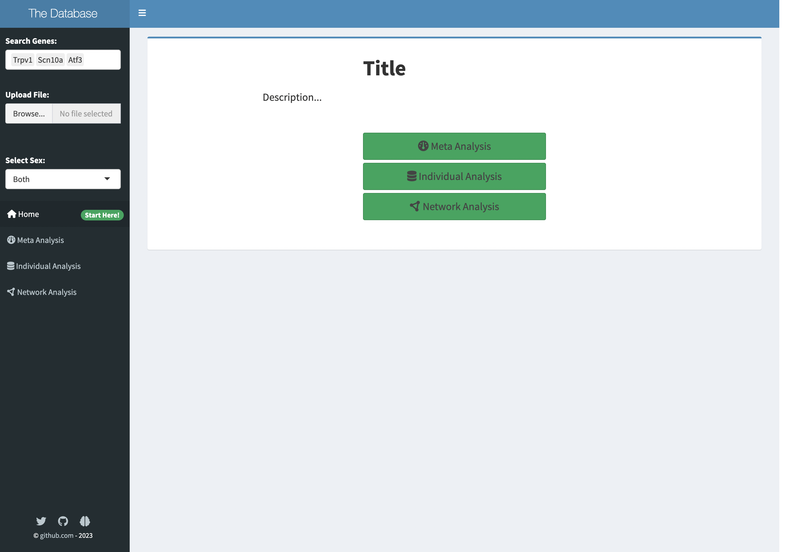
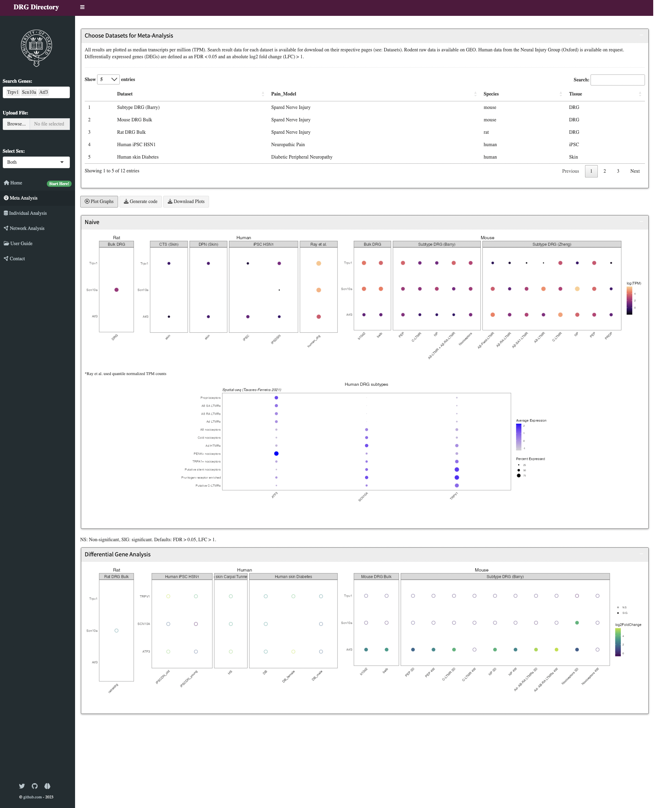
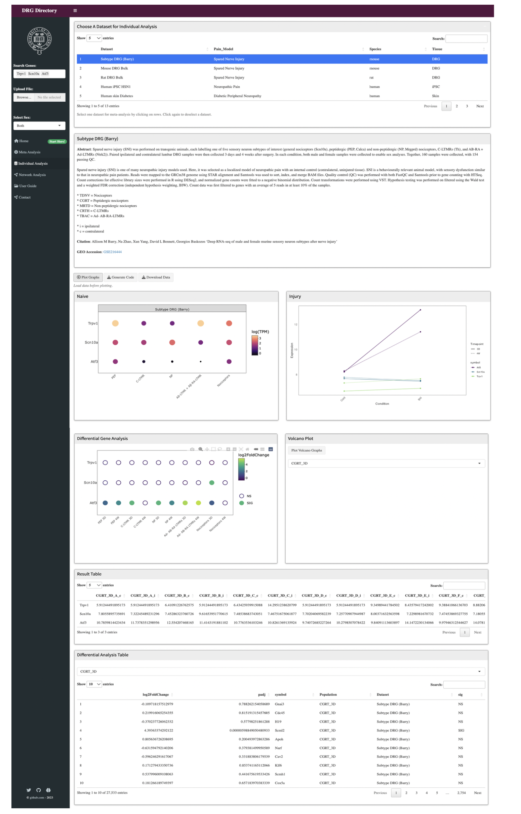
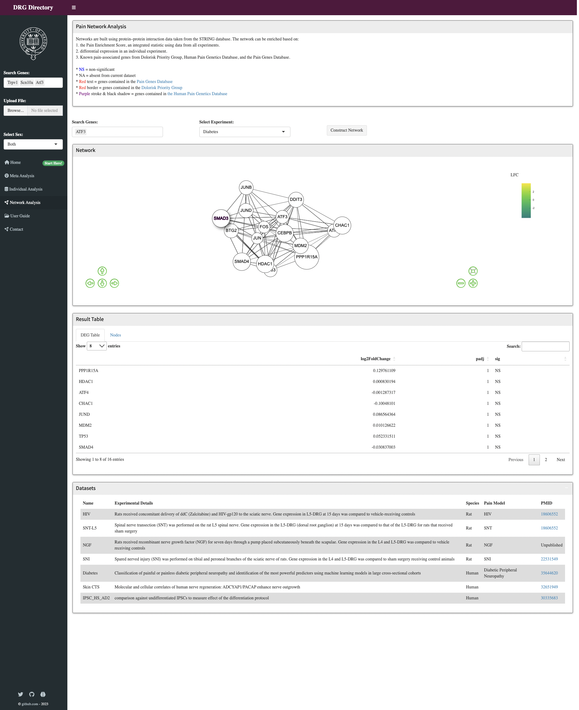

# User Interface {#ui}

<style>
img
{
    display:block;
    float:none;
    margin-left:auto;
    margin-right:auto;
}
</style>

1. Write descriptions for each dataset and save them in `.\des\DATASETNAME.Rhtml`
2. Modify titles and descriptions

At the most basic level, no changes are _needed_ here, although customization is recommended (eg. choose a title, add descriptions). Throughout this app, description files for each page are loaded in as `.Rhtml` or `.Rmd` files, which can be rendered in R.

```{r eval=FALSE}
# example descriptions
includeHTML("network.Rhtml")
includeMarkdown("userguide.Rmd")

```


Details are below, and basic UI tutorials can be found at <https://shiny.rstudio.com/tutorial/written-tutorial/lesson1/>.


## Basic structure 
A Shiny dashboard UI typically consists of three main parts, contained within `dashboardPage`:

1. **Dashboard header**: This is the top part of the dashboard, which contains the logo or title of the dashboard, and any navigation menus or links.

2. **Dashboard sidebar**: This is the vertical bar on the left-hand side of the dashboard that contains input controls, such as buttons, sliders, dropdown menus, or text inputs. The sidebar allows users to interact with the dashboard and filter or manipulate the data displayed in the main panel.

3. **Dashboard body/main panel**: This is the main part of the dashboard, which displays the data or visualizations based on the input controls selected in the sidebar. The main panel can contain any type of output, such as plots, tables, or text, and can be updated dynamically based on user input.


_Places commented in red texts are sites for customisation. Otherwise, this does not need to be modified_ 


## Header

```{r, eval=FALSE}
shinydashboard::dashboardHeader(title= "Title", ## Customise title
                                    titleWidth = 225)
```

## Styling

```{r, eval=FALSE}
  includeCSS("www/style.css"), ## uncomment to add a css style sheet (example included)
```

## Sidebar 
The sidebar contains a gene search input and tabs, which allow you to switch between different pages. The names of each tab can be customised by changing the label. 

```{r, eval = FALSE}
### this doesn't need to be altered, unless you want a footer or to change labels
shinydashboard::dashboardSidebar(width = 225,
     sidebarMenu(
       id = "tabs",
       
       # gene search  
       shiny::selectizeInput(
         inputId = "geneid",
         label = "Search Genes:",
         multiple = TRUE,
         choices = NULL
       ),
       
       # file upload 
       shiny::fileInput("file",
                        label = "Upload File:",
                        accept = c(
                          'text/csv',
                          'text/comma-separated-values',
                          'text/tab-separated-values',
                          'text/plain',
                          '.csv', '.txt',
                          '.tsv')),
       
       # clear button 
       actionButton("reset", "Clear"),
       
       # Filters for dataset 
       shiny::selectizeInput(
         inputId = "sex",
         label = "Select Sex:",
         choices = c('Both', 'Separate'),
         selected = 'Both'),
       
       # Sidebar menu for tabs (pages)
       shinydashboard::menuItem("Home", tabName = "tabhome", icon = icon("home"), badgeLabel = "Start Here!", badgeColor = "green"),
       shinydashboard::menuItem("Grouped Analysis", tabName = "tabmeta", icon = icon("dashboard")),
       shinydashboard::menuItem("Individual Analysis", tabName = "tabdata", icon = icon("database")),
       shinydashboard::menuItem("Network Analysis", tabName = "tabnet", icon = icon("circle-nodes")),
       shinydashboard::menuItem("User Guide", tabName = "tabcode", icon = icon("folder-open")),
       shinydashboard::menuItem("Contact", tabName = "tabguide", icon = icon("circle-nodes")),
       br(),
       br()
     ),
    
    ## Footer can be added 
    
    )
```

## Body 

In the body, the `tabItems` with corresponding values for `tabName`:
```{r, eval = FALSE}
### structure overview, each tab described below 
dashboardBody(
    tabItems(
      # First tab content
      tabItem(tabName = "tabhome",
          # content 
      ),

      # Second tab content
      tabItem(tabName = "tabmeta",
        # content 
      ),
      
      # other tabs 
    )
  )
```

### Homepage

The homepage displays the title and general description of the app, which can be customised by the user at places commented in red text.   

```{r, echo=FALSE}

```
```{r, eval = FALSE}
shinydashboard::tabItem(tabName = "tabhome", 
                  shinydashboard::box(
                    width = 12,
                    status = "primary",
                    column(width = 6, offset = 4,
                            #h1(strong("Title")) ##add title
                            ),
                    column(width = 8, offset = 2,
                            #h4("Description..."), ## add description
                            #br(),
                            br()
                    ),
                                  
                    column(width = 4, offset = 4, 
                            actionButton("meta_tab","Grouped Analysis", class = "btn-success btn-lg btn-block", icon = icon("dashboard")),
                            actionButton("ind_tab","Individual Analysis", class = "btn-success btn-lg btn-block", icon = icon("database")),
                            actionButton("net_tab","Network Analysis", class = "btn-success btn-lg btn-block", icon = icon("circle-nodes")),
                            br(),br()
                    )
                  ),
                  br()
                                
), 

# next tab follows
```

### Grouped comparisons 
Grouped comparisons contains integrative visualisation of multiple datasets. This page contains a table containing descriptions of each dataset, as well as integrative plots. Each item is contained within boxes, and their width can be adjusted by changing the width parameter. 

```{r, echo=FALSE}

```

There are three plots displayed in the example: 

1. Dot plot showing gene expression changes. 
2. Dot plot showing scRNA gene expression. 
3. Dot plot showing differential gene expression of genes. 

```{r, eval = FALSE}
shinydashboard::tabItem(tabName="tabmeta",
                                br(),
                                
        shiny::fluidRow(
          shinydashboard::box(status = "primary",
                              width = 12,
                              title = "Choose Datasets for Meta-Analysis",
                              solidHeader = TRUE,
                              
                              ## description 
                              p("ADD TEXT HERE"),
                              hr(),
                             
                              # table containing information of datasets 
                              DT::dataTableOutput("meta_table"),
                              collapsible = TRUE),
          
        ), br(),

        # buttons 
        fluidRow(
          column(12,offset = 0,
                 shiny::actionButton("load", "Plot Graphs", icon = icon("play-circle")),
                 shiny::downloadButton("combineplot", "Generate code"),
                 shiny::downloadButton("combineplots", "Download Plots")
                 
          )
        ), br(),
        
        shiny::fluidRow(
          
          # dot plots for bulk and single RNA sequencing 
          ## comment out plots that you don't need
          shinydashboard::box(width = 12,
                              title = "Naive",
                              collapsible = TRUE,
                              solidHeader = TRUE,
                              status = "primary",
                              plotcombine_ui("dot"),
                              plothomescdot_ui("homespat")
          )
        ),

        fluidRow(
          # DEG plots
          shinydashboard::box(width = 12,
                              title = "Differential Gene Analysis",
                              collapsible = TRUE,
                              solidHeader = TRUE,
                              status = "primary",
                              deg_combine_ui("deg_plot"))
        )
)
```

### Individual Analysis 

 The information and plots for a dataset can be displayed after selection. Different from previous pages, this page contains a dynamic UI that reacts to the user input (i.e. the dataset that users clicked in the table). This is achieved by the `uiOutput()` function, which tells Shiny when the pages should be rendered. The UI for each indiviual page is stored in a function `shinypageUI()`, which is called with different parameters in response to different datasets selected. 


```{r, eval = FALSE}
### this doesn't need to be altered
shinydashboard::tabItem(tabName = "tabdata",
        fluidRow(
          
          # a table that allows selection of a single dataset for visualisation 
          shinydashboard::box(status = "primary",
                              solidHeader = TRUE,
                              width = 12,
                              title = "Choose A Dataset for Individual Analysis",
                              DT::dataTableOutput("dataset_table"),
                              helpText("Select one dataset for meta-analysis by clicking on rows. Click again to deselect a dataset."),
                              collapsible = TRUE)
        ),  br(), 
        fluidRow(
          
          # a ui that is responsive to dataset selected 
          uiOutput("shinypages") 
        )
        )
```

The components included in each dataset are shown below. The code for each component is shown after, but _does not need to be altered, other than changing title for control and condition boxes_. 

The `shinypageUI()` function:
```{r, eval = FALSE}
#' The UI function for each individual dataset page
#'
#' @param datasetTitle The title for the page 
#' @param includedeg A Boolean value stating whether to include differential expression plots and tables 
#' @param volc_title The title for volcano plots 
#' @param include_subtype A Boolean value stating whether to include plots for different sub-populations. 
#' @param des_dir A directory for the description files. Default = NULL. 
#' @param image_dir A directory for any images. Default = NULL.
#' @param includegoi A Boolean stating whether to include result count table for selected genes. 
shinypageUI <- function(id, datasetTitle, includedeg = FALSE, volc_title = NULL,
                        include_subtype = FALSE, des_dir = NULL, image_dir = NULL, includegoi = TRUE, 
                        include_count = TRUE) {
  
  shiny::fluidPage(
    shiny::fluidRow(
      # Description for dataset 
      shinydashboard::box(title = datasetTitle,
                          width = 12,
                          status = "primary",
                          solidHeader = TRUE,
                          if (is.null(des_dir) == FALSE) {includeHTML(des_dir)}, ## links description files
                          if (is.null(image_dir) == FALSE) {img(src = image_dir, height = 150, width = 400)}
      )
    ),
    
    br(), 
    
    # buttons 
    shiny::actionButton(NS(id, "load"), "Plot Graphs", icon = icon("play-circle")),
    shiny::downloadButton(NS(id,"report"), "Generate Code"),
    shiny::downloadButton(NS(id,"plots"), "Download Data"),
    shiny::helpText(em("Load data before plotting.")),
    
    # plots using count data 
    if (include_count == TRUE){
      shiny::fluidRow(
        
        # gene expression dotplot 
        shinydashboard::box(title = "Control", ## change title 
                            status = "primary",
                            solidHeader = TRUE,
                            plotly::plotlyOutput(NS(id, "bulkseq_dots")),
                            height = "36em"
        ),
        
        # line plot showing differential expression in different treatment groups
        shinydashboard::box(title = "Condition", ## change title 
                            status = "primary", solidHeader = TRUE,
                            shiny::plotOutput(NS(id, "bulkseq_lines")),
                            height = "36em"
        ), br(), br()
      )
    },
    br(),
    
    # plots for experiments which divide samples into different groups e.g. different cell subtypes 
    if (include_subtype == TRUE) {
      # line plots showing differential gene expression in different experiment groups in response to treatment 
      shiny::fluidRow(
          shinydashboard::box(width = 12,
                              title = "Subtype Results", status = "primary",
                              solidHeader = TRUE,
                              shiny::plotOutput(NS(id, "bulkseq_lines_subtype"))
          )
      )
    },br(),
    
    # plots using differential expression data 
    if (includedeg == TRUE) {
      shiny::fluidRow(
        
        shinydashboard::box(width = 6,
                            title = "Differential Gene Analysis",
                            status = "primary",
                            solidHeader = TRUE,
                            plotly::plotlyOutput(NS(id, "deg_plot")),
                            
                            height = "38em"),
        
        # volcano plots 
        shinydashboard::box(width = 6,
                            title = volc_title, status = "primary",
                            solidHeader = TRUE,
                            actionButton(NS(id, "plotvolc"), "Plot Volcano Graphs"),
                            selectInput(NS(id, "volc_pop"), "",
                                        choices = NULL,
                                        selected = ""),
                            shiny::plotOutput(NS(id, "volcanoplot"), height = "26em"), height = "38em"
        )
      )
    },br(),
    
    # for displaying count data for genes selected 
    if(includegoi == TRUE) {
      shiny::fluidRow(
          shinydashboard::box(
            width = 12,
            title = "Result Table",
            status = "primary",
            solidHeader = TRUE,
            DT::dataTableOutput(NS(id,"goi_table"))
          )
      )
    },br(),
    
    # for displaying differential expression data 
    if(includedeg == TRUE) {
      shiny::fluidRow(
          shinydashboard::box(width = 12,
                              title = "Differential Analysis Table",
                              status = "primary",
                              solidHeader = TRUE,
                              selectInput(NS(id, "contrast"), "",
                                          choices = NULL,
                                          selected = ""),
                              DT::dataTableOutput(NS(id, "contrast_table"))
          )
    )
    }
  ) 
}
```

```{r, echo=FALSE}

```


### Network page

We also provide an option for basic network analyses. The network tab contains a description box, a gene search bar, a network, a result table containing differential expression values, and a table containing information for datasets from RNA-seq and microarray studies. 

On the server-side, this network is generated from STRING DB and reconstructed with `visNetwork`. In this app, users can also colour/annotate the network based on experimental results. 

```{r,echo = FALSE}

```

```{r, eval = FALSE}
# UI for the network page
shinydashboard::tabItem(tabName = "tabnet",
        fluidRow(
          shinydashboard::box(title = "Network Analysis", ## modify title as needed
                              width = 12,
                              status = "primary",
                              solidHeader = TRUE,
                              
                              ## insert description files 
                              includeHTML("des/network.Rhtml")
          )
        ),br(),
        
        # gene search bar and filter bar 
        fluidRow(
          column(width = 3,
                 selectizeInput(
                   inputId = "gene_symbols",
                   label = "Enter Query Gene Symbols:",
                   multiple = TRUE,
                   choices = NULL
                 )
          ),
          column(width = 3,
                 selectInput("pop", "Select Experiment:",
                             
                             ## customize choices of datasets for different modes of annotation 
                             choices = c("Pain Enrichment Score", unique(data$experiment_id)),
                             selected = "Diabetes") ## choose one of your datasets
                 
          ),
          column(width = 3,br(),
                 actionButton("submit", "Construct Network")), style = "margin-top:20px;"
        ), 
        
        # render network 
        fluidRow(
          shinydashboard::box(width = 12, status = "primary",
                              solidHeader = TRUE, title = "Network",
                              column(width = 10,
                                     visNetwork::visNetworkOutput("network", height = "435px")
                              ), height = "38em",
                              
                              # legends
                              column(width = 2,
                                     uiOutput("netlegend")
                              )
                              
          ),
        ), br(),
        
        # result table 
        fluidRow(
          shinydashboard::box(width = 12, status = "primary",
                              solidHeader = TRUE, title = "Result Table",
                              tabsetPanel(
                                tabPanel( "DEG Table",
                                          DT::dataTableOutput("contrast_table")
                                ),
                                tabPanel("Nodes",
                                         DT::dataTableOutput("protein_table")
                                )
                              ),
                              height = "38em"
          )
        ),br(),
        
        # a table containing descriptions of experiments involved, their methods and treatment groups
        fluidRow(
          shinydashboard::box(status = "primary",
                              solidHeader = TRUE,
                              width = 12,
                              title = "Datasets",
                              column(width = 12,
                                     
                                     ## Insert table html files 
                                     includeHTML("des/datatable.html")
                              ),
                              collapsible = TRUE),
        )
)
```
