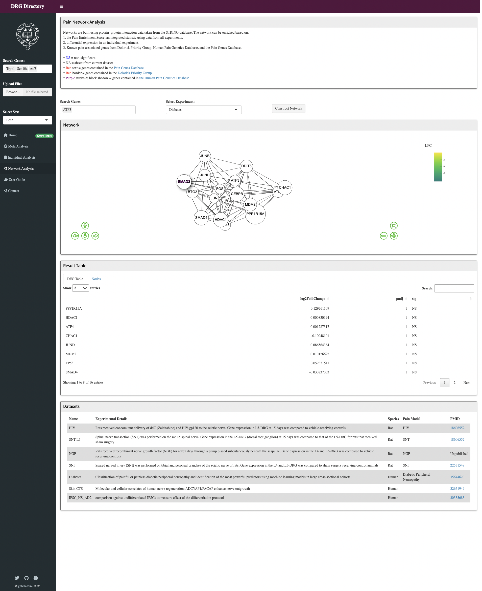

# Server {#server}

<style>
img
{
    display:block;
    float:none;
    margin-left:auto;
    margin-right:auto;
}
</style>

Once you:  
1. Have created a dataset description `des_df` object  
2. Have changed the directory of the `.db` to the one you have stored your data in

...you can start running the app.

_(but lots of details are provided below so you can dive into the code)_


## Requirements 

For the `Server.R` page to run, you will need to create a `des_df`, a description df that describes your datasets. An example is shown below: 

* **Dataset**: The name of the dataset 
* **condition**: The experimental disease group name
* **species**: the species in the experiment
* **count**: the name of the count matrix 
* **colDatas**: The name of experimental design 
* **deg_df_name**: the name of differential expression data
* **type**: Name of the RNA sequencing technique; either bulk or single 
* **page_id**: This identifier is useful for loading description files specific for each experiment. E.g. subtype.Rhtml . Name your description files and add their names to this column. 
* **include_subtypes**: This specifies if there are different subtypes of samples in the experiment. E.g. different species strains. If TRUE, there will be an additional line plot showing subtype-specific changes in gene expression. 
* **include_degs**: This specifies if there are differential expression data files for this experiment. If TRUE, the visualisation page will yield differential expression dot plots and volcano plots. 

```{r}
### example with one bulk dataset
des_df = data.frame(
  Dataset = c("Subtype DRG (Barry)"),
  condition = c("ipsi"),
  Species = c("mouse"),
  count = c("bulkseq_mat"),
  include_subtypes = c(TRUE),
  include_degs = c(TRUE),
  page_id = c("subtype"),
  deg_df_name = c("subtype_deg_df"),
  colDatas = c("bulkseq_colData"),
  type = c("bulk"),
  Tissue = c("DRG"))

### example with bulk and single cell datasets
des_df = data.frame(
  Dataset = c("Subtype DRG (Barry)", "Mouse DRG Bulk", "Human DRG spatial-seq"),
  condition = c("ipsi", "SNI", "N/A"),
  Species = c("mouse", "mouse", "human"),
  count = c("bulkseq_mat", "TPM_mouse", ""),
  include_subtypes = c(TRUE, FALSE, FALSE),
  include_degs = c(TRUE, TRUE, FALSE),
  page_id = c("subtype", "mouse", "scrna"),
  deg_df_name = c("subtype_deg_df", "mouse_deg_df", ""),
  colDatas = c("bulkseq_colData", "TPM_mouse_colData", ""),
  type = c("bulk","bulk", "single"),
  Tissue = c("DRG", "DRG", "DRG"))


kbl(des_df %>% head) %>% kable_styling(bootstrap_options = c("striped", "hover", "condensed", "responsive"), font_size = 12, latex_options = "scale_down") %>% scroll_box(width = "100%", height = "500px")
```
&nbsp;

The table names of `countdata` and `colData` for each experiment will be written. This allows the app to directly query those tables from the database object. In addition, you will need to specify directory that storing your data 

```{r, eval = FALSE}
## directory for scRNA sequencing data;  
{
  scRNA_dir   = NULL # leave it for NULL if none
  scRNA_names = NULL # leave it for NULL if none
  scRNA_dir = list()
  scRNA_dir = c(scRNA_dir, list("drg.combined.rds")) #set for single  cell data
  scRNA_names = c("Human DRG spatial-seq") #names for single  cell data

  names(scRNA_dir) = scRNA_names

  if (length(scRNA_dir) != 0) {
    library(Seurat) # for scRNA; only load library if scRNA data is present
  }
}

## RData that contains DEG files for network analysis 
network_dir = "data/network.RData"

## directory for the sql database 
sql_dir = "test.db"
```


## Server Overview

_You don't need to modify this, but is provided as an overview of the app structure_. 

`server()` function is invoked each time a new session starts. When the server function is called it creates a new local environment that is independent of every other invocation of the function. This allows each session to have a unique state, as well as isolating the variables created inside the function.

Server functions take three parameters: `input`, `output`, and `session`. The input argument is a list-like object that contains all the input data sent from `ui.R`, named according to the input ID. 

### Side bar 
Update the gene symbols entered or uploaded in files into reactive variables. 
```{r, eval = FALSE}
# gene search bar
shiny::updateSelectizeInput(session,
                          inputId = "geneid",
                          label = "Search Genes:",
                          choices = allgenes,
                          server = TRUE,
                          selected = c("Trpv1", "Scn10a","Atf3") ## can change to relevant genes
)
  
# a reactive variable that records whether a file is uploaded.
rv <- reactiveValues(
  clear = FALSE,
  data = FALSE
)

# read in files uploaded 
shiny::observeEvent(input$file, {
  rv$clear <- FALSE
  rv$data = TRUE
}, priority = 1000)

# clear the file space when files are removed
shiny::observeEvent(input$reset, {
  rv$clear = TRUE
  rv$data = FALSE
})

# read into gene ids from files
file_input <- reactive({
  if (rv$clear == TRUE) {
    return(NULL)
  }
  if(rv$clear==FALSE && rv$data == TRUE) {
    goi = read.table(input$file$datapath)
    rownames(goi) <- goi[,1]
    goi <- goi[which(rownames(goi) %in% allgenes==TRUE),]
    return(goi)}
})

genes = reactive({
  if (is.null(file_input())) {
    genes = input$geneid
  }
  else {
    genes = file_input()
  }
})
```

### Tab Menu 
Update active tab based on the current selection of a tab menu. 
```{r, eval = FALSE}
### this doesn't need to be modified
shiny::observeEvent(input$metaa, {
  Newtab <- switch(input$tabs, "tabhome" = "tabmeta")
  shinydashboard::updateTabItems(session, "tabs", Newtab) 
})

shiny::observeEvent(input$inda, {
  Newtab <- switch(input$tabs,"tabhome" = "tabdata")
  shinydashboard::updateTabItems(session, "tabs", Newtab) 
})

shiny::observeEvent(input$neta, {
  Newtab <- switch(input$tabs,"tabhome" = "tabnet")
  shinydashboard::updateTabItems(session, "tabs", Newtab) 
})
```

### Grouped comparisons

By using the same visualization tools and methods across studies, it becomes easier to compare and integrate results from different studies.

```{r, echo = FALSE}
knitr::include_graphics("./data/Images/meta.png")
```

1. Render a table for datasets included 
```{r, eval = FALSE}
output$meta_table = DT::renderDataTable({
    DT::datatable(
      bulk_df[c("Dataset", "Pain_Model", "Species", "Tissue")], ## can select relevant columns
      width = 6,
      class = 'nowrap',
      options = list(scrollX = TRUE, scrollY = TRUE, pageLength = 5), 
      selection = "none"
      # selection = list(mode = "multiple", selected = list(rows = c(1:nrow(bulk_df)), cols = c(1:4)), target = "row+column")
    )
  })
```

2. Generate homepage plots 

* A combined gene expression dot plots
* A scRNA dotplot based on a `Seurat` object
* A differential expression dot plot that allows visualisation of the significance level of differential gene expression
```{r, eval = FALSE}
### this doesn't need to be modified
# plot in reponse to the 'load' button 
observeEvent(input$load, {
    
    # load scRNA data if it exists 
    if (is.null(scRNA_dir) == FALSE) {
      for (c in scRNA_dir) {
        variables$pbmc <- c(variables$pbmc, readRDS(scRNA_dir[[1]]))
      }
      names(variables$pbmc) = scRNA_names
    }
    
    # read geneids from file if it exists 
    file_input <- reactive({
      if (rv$clear == TRUE) {
        return(NULL)
      }
      if(rv$clear==FALSE && rv$data == TRUE) {
        goi = read.table(input$file$datapath)
        rownames(goi) <- goi[,1]
        goi <- goi[which(rownames(goi) %in% allgenes==TRUE),]
        return(goi)}
    })
    
    if (is.null(file_input())) {
      genes = input$geneid
    }
    else {
      genes = file_input()
    }
    
    # plot homepage dot plots and DEG plots
    if (nrow(bulk_df) != 0) {
      
      # include all bulk datasets in the combined plots
      selected_data = c(1:nrow(bulk_df))
      
      df_list = list()
      for (i in c(1:nrow(bulk_df))){
        curr = bulk_df[i,]
        d = curr$count

        # if using sql 
        if (!is.null(sql_dir)) {
          if (curr$Species == "human"){
            sql = paste("SELECT * FROM", d, "WHERE mgi_symbol = ?")
          }
          else {
            sql = paste("SELECT * FROM", d, "WHERE symbol = ?")
          }
          count_data = as.data.frame(dbGetPreparedQuery(conn, sql, bind.data=data.frame(symbol=genes)))
        }
        
        # if using RData
        if (!is.null(rdata_dir)) {
          ct = mat[[d]]
          if (curr$Species == "human"){
            count_data = ct[ct$mgi_symbol %in% genes,]
          }
          else {
            count_data = ct[ct$symbol %in% genes,]
          }
        }
        
        # a list of filtered count data 
        df_list = append(df_list, list(count_data))
      }
      
    
      final_df = generate_combine_dataset(df_list, genes, input$sex, col_list[selected_data], des_df$condition[selected_data], des_df$Species[selected_data], 
                                          expression, Condition, Population, symbol, Dataset, Species)
      
      # homepage dotplot
      combine_dot = plotcombine_server("dot", final_df, input$sex, genes, Population, symbol, expression, "Dataset") #dotplot
      
      # deg plot
      
      # first, convert gene symbols to species specific 
      hgenes = human_gene_data[human_gene_data$mgi_symbol %in% genes,]$hgnc_symbol
      rgenes = rat_gene_data[rat_gene_data$mgi_symbol %in% genes,]$rgd_symbol
      
      # filter differential expression data 
      degr = degrat[degrat$symbol %in% rgenes,]
      degm = degmouse[degmouse$symbol %in% genes,]
      degh = deghuman[deghuman$symbol %in% hgenes,]
      
      combine_degplot = deg_combine_server("deg_plot",degr, degm, degh, Population,symbol, log2FoldChange,sig, "Dataset")
    }
   
    # give scRNA dot plots if data exists 
    if (is.null(variables$pbmc) != TRUE){
      scrna_dot = plothomescdot_server("homespat", variables$pbmc, genes)
    }
    
    # download all plots into a zip
    output$combineplots <- downloadHandler(
      filename = function() {
        paste("combined", "zip", sep=".")
      },
      
      content = function(file){
        # Set temporary working directory
        owd <- setwd(tempdir())
        on.exit(setwd(owd))
        fs = c()
        
        # Save the plots
        ggsave('combine_deg.png', plot = combine_degplot, width = 14, height = 6, dpi = 300, units = "in", device='png')
        ggsave('combine_dot.png', plot = combine_dot, width = 14, height = 6, dpi = 300, units = "in", device='png')
        ggsave('scrna_dot.png', plot = scrna_dot, width = 10, height = 8, dpi = 300, units = "in", device='png')
        fs = c(fs, 'combine_deg.png')
        fs = c(fs, 'combine_dot.png')
        fs = c(fs, 'scrna_dot.png')
        
        # csv files for gene count data
        write.csv(final_df,"result_table.csv", row.names = FALSE, col.names = TRUE)
        
        fs = c(fs, "result_table.csv")
        
        zip(file, fs)
      }
    )
    
  })
  
```

### Individual Analysis 
```{r, echo = FALSE}
knitr::include_graphics("./data/Images/indiv.png")
```

First, a table that contains dataset description is rendered at the top. 
```{r, eval = FALSE}
output$dataset_table = DT::renderDataTable({
DT::datatable(
  des_df[c("Dataset", "Pain_Model", "Species", "Tissue")], ## can select relevant columns
  width = 6,
  class = 'nowrap',
  options = list(scrollX = TRUE, scrollY = TRUE, pageLength = 5), selection = "single"
)
})

```

Next, the ui for each independent dataset is rendered in response to row selected from the table. This is passed by the `input$dataset_table_rows_selected` parameter and stored into a reactive variable indrows. The parameters required for calling the `shinypageUI` function is retrieved from the `des_df`. 

```{r, eval = FALSE}
variables = reactiveValues({
  indrows = NULL 
})

shiny::observe({
    variables$indrows =input$dataset_table_rows_selected
  })

output$shinypages  = shiny::renderUI({
    j = input$dataset_table_rows_selected
    select = des_df[j,]
    
    if (select$type == "single"){
      shinyscrnapageUI("spatpage", select$Dataset)
    }
    
    else {
      page_id = select$page_id
      shinypageUI(page_id, select$Dataset,
                  select$include_degs,
                  select$include_subtypes, des_dir = NULL)
    }
    
})
```

The server functions for each study-specific ui called is shown below. The shinypage server module contains code for generating plots and result tables. 
```{r, eval = FALSE}

shiny::observe({
    i = input$dataset_table_rows_selected
    
    if (is.null(i) == FALSE) {
      selected = des_df[i,]
      page_id = selected$page_id
      
      # bulk rnaseq 
      if (selected$type == "bulk") {
        shiny::callModule(shinypage, page_id, input$sex, selected$count, as.data.frame(col_list[i]),
                          selected$Species, selected$condition, reactive({genes()}), deg_df_name = selected$deg_df_name,
                          dataset = selected$Dataset, parent = session)
      }
      
      # single rnaseq
      if (selected$type == "single"){
        
        if (is.null(variables$pbmc[[selected$Dataset]]) == TRUE) {
          
          # make sure that scRNA data is already read into reactive variables
          for (c in scRNA_dir) {
            variables$pbmc <- c(variables$pbmc, readRDS(scRNA_dir[[1]]))
          }
          names(variables$pbmc) = scRNA_names
        }
        
        shiny::callModule(shinyscrna, "spatpage", reactive({genes()}), variables$pbmc[[selected$Dataset]])
      }
    
    }
    
  })
```

## Network Analysis 

Network integration can give context when working with large datasets, and provide a platform to integrate information from multiple sources. 

```{r, echo = FALSE}

```

Here, networks are built using protein–protein interaction data taken from the STRING database. The network can be enriched in various ways. As an example, we have enriched the STRING networks in our example by:  

1. An _Enrichment Score_, an integrated statistic using data from all experiments. 
2. Differential expression in an individual experiment. 
3. Genes of interest, as a list
* Here, we used known pain-associated genes from various sources

```{r, eval = FALSE}
# update choice
shiny::updateSelectizeInput(session,
                            inputId = "gene_symbols",
                            label = "Search Genes:",
                            choices = human_gene_data$hgnc_symbol,
                            server = TRUE,
                            selected = c("ATF3") ## choose your favourite
)
```

### Integration with STRING DB

Node and edge data is extracted in real-time from STRING <https://string-db.org/> and reconstructed into a network based on user input.

_For reference only, you don't need to modify this._

```{r, eval = FALSE}
### this doesn't need to be modified
# generates network  when the submit button is clicked 
observeEvent(input$submit, {
    # Query gene interactions
    genes_list = as.vector(input$gene_symbols)
    genes = paste(genes_list, collapse = "%0d")
    interactions <- query_interactions(genes, 10)
    proteins = unique(c(unique(interactions$preferredName_A), unique(interactions$preferredName_B)))
    nodes = data.frame()
    id = unique(c(unique(interactions$stringId_A), unique(interactions$stringId_B)))
    nodes= as.data.frame(id)
    nodes$label = proteins
    nodes = mutate(nodes, shape = ifelse(nodes$label %in% input$gene_symbols, "diamond", "circle"))
    
    
    if (input$pop == "Composite Enrichment Score") {
      mode = "meta"
      metrics = score_df
      dt = score_df[score_df$symbol %in% proteins,]
    }
    else {
      mode = "indiv"
      # the dict contains deg_df based on the name of datasets
      # res = network_df[network_df$experiment_id == input$pop,]
      res = degall[degall$Dataset == input$pop,]
      res = subset(res, !duplicated(symbol))
      res = mutate(res, sig=ifelse((res$padj<0.05), "SIG", "NS"))
      metrics = res
      
      # account for species differences 
      
      if (unique(res$Species) == "mouse") {
        proteins = human_gene_data[human_gene_data$hgnc_symbol %in% proteins,]$mgi_symbol
      }
      if (unique(res$Species) == "rat") {
        proteins = human_gene_data[human_gene_data$hgnc_symbol %in% proteins,]$mgi_symbol
      }
      dt = filter(res, symbol %in% proteins)  # this means the proteins must be in human symbol
      
      # remove duplicate 
      
      rownames(dt) = dt$symbol
      dt = dt[c("log2FoldChange","padj", "sig")]

    }
    
    # network construction
    nodes = get_nodes(interactions, genes_list, metrics, mode=mode, snps, pg1, pg2)
    edges <- data.frame(from = interactions$stringId_A, to = interactions$stringId_B, width = interactions$score,
                        color = "#444444")
    
    lnodes <- data.frame(shape = c( "icon"), 
                         icon.color = c("#961252", "#d8aec4ff", "lightgrey", "#aed5eaff","#0277bd"),
                         icon.code  = c("f35b", "f111", "f111", "f111", "f358"),
                         icon.size = 30) 
    
    # network visualisation
    nw = visNetwork::visNetwork(nodes, edges, height = "500px", width = "100%") %>%
      visPhysics(enabled = FALSE,solver = "forceAtlas2Based",
                 forceAtlas2Based = list(avoidOverlap = 1)) %>%
      visEdges(smooth = FALSE) %>%
      visInteraction(navigationButtons = TRUE, zoomSpeed = 0.6) %>%
      visLegend(addNodes = lnodes, 
                #main = list(text = "Enrichment", style = "font-family:Gadugi"),
                useGroups = FALSE, 
                width = 0.2, 
                position = "right",
                ncol = 1,
                stepY = 50,
                #stepX = 50,
                zoom = FALSE)
    output$network <- renderVisNetwork({nw})
    
    output$downloadnet <- downloadHandler(
      filename = "graph.html",
      content = function(file) {
        visSave(nw, file)
      }
    )
    
    output$contrast_table <- DT::renderDataTable({
      DT::datatable(
        dt,
        width = 6,
        class = 'nowrap',
        options = list(scrollX = TRUE, pageLength = 8)
      )
    })
    
    # a table containing description and information of genes included
    output$protein_table <- DT::renderDataTable({
      DT::datatable(
        query_information(proteins),
        width = 6,
        class = "wrap",
        options = list(scrollX = TRUE, pageLength = 8)
      )
    })
    
  })
```


## Functions 

_An run-down of functions used throughout the app. For basic applications these don't need to be modified._ A function can be called and reused multiple times by passing parameters. For this example database, functions are written for rendering plots. To illustrate them, we will use an example count dataset. 

### Data processing  

```{r}
#' a function that gets the median expression of a count data 
get_median <- function(df, sex, var, ...){
  ifelse(sex=="Both", data <- df %>% dplyr::group_by(...) %>%
           dplyr::summarise(expression=median(as.double({{var}}))), df <- tcounts %>% dplyr::group_by(..., Sex) %>%
           dplyr::summarise(expression=median(as.double({{var}}))))
  return(data)
}
```

```{r, message = FALSE}
genes = c("Atf3", "Msh6", "Dlst", "Slc2a9")
sex = "Both"

# load data
count   = read.csv("./data/CountTables/TPM_mouse.csv", header = TRUE)
colData = read.csv(paste0("./data/colData/", "TPM_mouse_colData.csv"), header = TRUE)
rownames(colData) = colData$X

# filter data
filt = count[count$symbol %in% genes,]
matfilt = filt[,!(names(filt) %in% c("symbol"))] 

# rename the first column 
colnames(matfilt) = c("gene", colnames(matfilt)[2:length(colnames(matfilt))])
rownames(matfilt) = matfilt$gene

# group based on experimental conditions 
tcounts <- t(matfilt) %>%
  base::merge(colData, ., by="row.names") %>%
  tidyr::gather(gene, expression, (ncol(.)-nrow(matfilt)+1):(ncol(.)))

tcounts$symbol = filt[filt$X %in% tcounts$gene,]$symbol

# get median expression
tcounts_med = get_median(tcounts, sex, expression, Condition, Population, symbol, Dataset, Species)
tcounts_med <- tcounts_med[!tcounts_med$Condition %in% "SNI", ] # remove pain samples
```


### Dot plots 
* median counts _(here, transcripts per million (TPM))_

```{r, message = FALSE, echo=FALSE}
library(ggplot2)
library(viridis)
library(ggrepel)

# labels and themes 
population_labels = c("TBAC" = "A\u03b4-LTMR + A\u03b2-RA-LTMR",
                      "CRTH" = "C-LTMR", "MRTD" = "NP",
                      "CGRT" = "PEP", "TDNV" = "Nociceptors", 
                      "B10.D2" ="b10d2", 
                      "BALB.c" = "balb", 
                      "DRG" = "                                DRG",
                      "iPSC" = "                               iPSC", 
                      "iPSDN" = "iPSDN", "skin" = "skin", 
                      "Aβ.Field.LTMR" = "A\u03b2-Field-LTMR",
                      "Aβ.RA.LTMR" = "A\u03b2-RA-LTMR",
                      "Aβ.SA1.LTMR" = "A\u03b2-SA1-LTMR",
                      "Aδ.LTMR" = "A\u03b4-LTMR",
                      "Nonpeptidergic.Nociceptor"= "NP",
                      "Peptidergic.Nociceptor"= "PEP",
                      "Proprioceptor"         = "PROP",
                      "c"  = "DRG")
sexlabels = c("F" = "Female", "M" = "Male", "mixed" = "Mixed","Mixed" = "Mixed")
subpopulations = c(
  "Nociceptors 3D" = "TDNV_3D.csv", "Nociceptors 4W" = "TDNV_4W.csv",
  "PEP 3D" = "CGRT_3D.csv", "PEP 4W" = "CGRT_4W.csv", 
  "NP 3D" = "MRTD_3D.csv","NP 4W" = "MRTD_4W.csv",
  "C-LTMR 3D" = "CRTH_3D.csv","C-LTMR 4W" = "CRTH_4W.csv",
  "Ad- AB-RA LTMRs 3D" = "TBAC_3D.csv","Ad- AB-RA LTMRs 4W" = "TBAC_4W.csv"
)

subpopulation_labels = c(
  "TDNV_3D" = "Nociceptors 3D", "TDNV_4W" = "Nociceptors 4W",
  "CGRT_3D" = "PEP 3D","CGRT_4W" = "PEP 4W", 
  "MRTD_3D" = "NP 3D", "MRTD_4W" = "NP 4W",
  "CRTH_3D" = "C-LTMR 3D","CRTH_4W" = "C-LTMR 4W",
  "TBAC_3D" = "Ad- AB-RA LTMRs 3D", "TBAC_4W" = "Ad- AB-RA LTMRs 4W", 
  "B10.D2" ="b10d2", 
  "BALB.c" = "balb",
  "DRG" = "                         DRG",
  "old" = "iPSCDN_old",
  "young" = "         iPSCDN_young",
  "Diabetes" = "diabetes",
  "Diabetes_female" = "Diabetes_female",
  "Diabetes_male" = "Diabetes_male",
  "skin" = "skin"
)

```

```{r, message = FALSE}
plot_dotplot <- function(data, x_var, y_var, col_var, facet_var, sex){
  x_var = enquo(x_var)
  y_var = enquo(y_var)
  col_var = enquo(col_var)
  
  g = ggplot2::ggplot(data = data, aes(x=!!x_var, y = !!y_var)) +
    scale_colour_viridis_c(option = "magma", end = .90) +
    geom_point(aes(col=log(!!col_var), size=log(!!col_var))) + 
    facet_grid(.~.data[[facet_var]], scales = "free", space="free") +
    scale_x_discrete(labels=population_labels) + labs(col="log(TPM)", size = "") +
    guides(size = "none")
  
  # add themes 
  g = g + theme_bw() + theme(panel.grid = element_blank(),
                        axis.title = element_blank(),
                        axis.text.x = element_text(size=8, angle = 45, hjust= 1),
                        axis.text.y = element_text(size=10),
                        axis.ticks.x = element_blank(),
                        axis.ticks.y = element_blank(), legend.justification = c(0,0.3),
                        strip.text.x = element_text(size = 9, margin = margin(6, 2, 6, 2)), 
                        panel.spacing = unit(0.25, "mm")) 

  
  if (sex == "Separate") {
    g = g + facet_wrap(~Sex, labeller = labeller(Sex = sexlabels), scales ="free_x")
  }
  return(g)
}

dotplot = plot_dotplot(tcounts_med, Population, symbol, expression, "Dataset", sex)
print(dotplot)
```

### Line plots
* Median gene expression in case and control conditions
* Linetype is encoded by the timepoint of treatment group (if exists)

```{r, message = FALSE}
#' @param group_vars symbol, Timepoint
#' @param linetype_var Timepoint
#'
plot_lineplot <- function(data,sex, x_var, y_var, col_var, linetype_var, ...){
  x_var = enquo(x_var)
  y_var = enquo(y_var)
  col_var = enquo(col_var)
  group_vars = enquos(...)
  linetype_var = enquo(linetype_var)
  
  theme_line = theme_bw() + 
                theme(panel.grid = element_blank(),
                      axis.title = element_text(size=12),
                      axis.text.x = element_text(size=10, angle = 45, hjust= 1),
                      axis.text.y = element_text(size=10),
                      axis.ticks.x = element_blank(),
                      axis.ticks.y = element_blank(), legend.justification = c(0,0.3))
  
  
  lineplot = ggplot2::ggplot(data, aes(x=!!x_var, y=!!y_var, group=interaction(!!!group_vars))) +
    scale_colour_viridis(discrete=TRUE, end = .80) +
    geom_line(aes(color=!!col_var, linetype=!!linetype_var)) + geom_point(aes(col=!!col_var)) + theme_line + ylab("Expression") +
    guides(linetype=guide_legend(label.hjust=0.5))
  if (sex =='Separate'){
    lineplot = lineplot + facet_wrap(~Sex, labeller = labeller(Sex = sexlabels), scales = "free_x") + labs(col="")
  }
  
  return(lineplot)
}

tcounts_m = get_median(tcounts, sex, var = expression, Condition, symbol, Timepoint, Dataset, Species)

lineplot = plot_lineplot(tcounts_m, sex, Condition, expression, symbol, Timepoint, symbol, Timepoint)
print(lineplot) 
```

### A differential expression dot plot  
* Colour intensity encodes the log2 fold change 
* Dot represents if the change is significant (filled) or not (unfilled). 

```{r, message = FALSE, echo=FALSE}
deg = read.csv(paste("./data/DegData/b10d2.csv", sep=""), header = TRUE, row.names = 1)
deg_df = deg[deg$symbol %in% genes,]
deg_df = mutate(deg_df, sig=ifelse(deg_df$padj<0.05, "SIG", "NS"))
```


```{r, message = FALSE}
plot_degplot <- function(data, x_var, y_var, col_var, shape_var){
  
  x_var = enquo(x_var)
  y_var = enquo(y_var)
  col_var = enquo(col_var)
  shape_var = enquo(shape_var)
  
  degplot = ggplot2::ggplot(data, aes(x=interaction(!!x_var), y = !!y_var,
                                      text = paste('padj: ',padj))) +
    scale_colour_viridis_c(option = "viridis", end = .90) +
    geom_point(aes(col=!!col_var, shape=!!shape_var, size=0.5)) + scale_shape_manual(values=c(1, 19)) +
    labs(shape = "", size = "") + scale_x_discrete(labels=subpopulation_labels) + 
    guides(size = "none")
  
  degplot = degplot + theme_bw() + theme(panel.grid = element_blank(),
                        axis.title = element_blank(),
                        axis.text.x = element_text(size=8, angle = 45, hjust= 1),
                        axis.text.y = element_text(size=10),
                        axis.ticks.x = element_blank(),
                        axis.ticks.y = element_blank(), legend.justification = c(0,0.3),
                        strip.text.x = element_text(size = 9, margin = margin(6, 2, 6, 2)), 
                        panel.spacing = unit(0.25, "mm")) 
  
  return(degplot)
}

degplot = plot_degplot(deg_df, Population, symbol, log2FoldChange, sig)
print(degplot)
```

### A volcano plot

* showing case vs control samples
* genes of interest are labelled using colour. 

```{r, message = FALSE}
plot_volcanoplot <- function(data, il_genes, x_var, y_var, label_var){
  
  x_var = enquo(x_var)
  y_var = enquo(y_var)
  label_var = enquo(label_var)
  
  volcanoplot = ggplot2::ggplot(data = data, aes(x = !!x_var, y = !!y_var)) +
    geom_point(colour = "grey", alpha = 0.5) +
    geom_point(data = il_genes, # New layer containing data subset il_genes
               size = 2,
               shape = 21,
               fill = "firebrick",
               colour = "black") +
    geom_hline(yintercept = -log10(0.05),
               linetype = "dashed") +
    geom_vline(xintercept = c(log2(0.5), log2(2)),
               linetype = "dashed") +
    geom_label_repel(data = il_genes,
                     aes(label = !!label_var),
                     force = 2,
                     nudge_y = 1) +
    # scale_colour_manual(values = cols) +
    scale_x_continuous(breaks = c(seq(-10, 10, 2)),
                       limits = c(-10, 10)) + 
    # theme_line +
    labs(y="-log10(FDR)")
  
  return(volcanoplot)
  
}


res = mutate(deg, log10fdr=-log10(padj))
volc_df = res[res$symbol %in% genes,]
volcanoplot = plot_volcanoplot(res, volc_df, log2FoldChange, log10fdr, symbol)
print(volcanoplot)
```

### Other

A downloadable R Markdown report can be generated by clicking the "Generate Code" button, as shown below. 
```{r, eval = FALSE}
# download a R markdown report 
output$combineplot <- downloadHandler(
  filename = "RNAseq_homeplot.html",
  content = function(file) {
    
    params <- list(matrix = final_df, genes = genes, sex = input$sex, scRNA = variables$pbmc, ratdeg = degr,
                   mousedeg = degm, humandeg = degh,
                   human_gene_data = human_gene_data)
    
    shiny::withProgress(value = 0,
                        message = 'Rendering plotting report',
                        detail =  'This might take several minutes.',{
                          rmarkdown::render(input = "reports/combineplot.Rmd",
                                            params = params,
                                            output_file = file,
                                            envir = new.env(parent = globalenv()))
                        })
    
  }
) # closure for download handler

```

The plots can also be downloaded as a zip file via a download button "Download Data". 
```{r, eval = FALSE}
# download all plots into a zip
output$combineplots <- downloadHandler(
  filename = function() {
    paste("combined", "zip", sep=".")
  },
  
  content = function(file){
    # Set temporary working directory
    owd <- setwd(tempdir())
    on.exit(setwd(owd))
    fs = c()
    
    # Save the plots
    ggsave('combine_deg.png', plot = combine_degplot, width = 14, height = 6, dpi = 300, units = "in", device='png')
    ggsave('combine_dot.png', plot = combine_dot, width = 14, height = 6, dpi = 300, units = "in", device='png')
    ggsave('scrna_dot.png', plot = scrna_dot, width = 10, height = 8, dpi = 300, units = "in", device='png')
    fs = c(fs, 'combine_deg.png')
    fs = c(fs, 'combine_dot.png')
    fs = c(fs, 'scrna_dot.png')
    
    # csv files for gene count data
    write.csv(final_df,"result_table.csv", row.names = FALSE, col.names = TRUE)
    
    fs = c(fs, "result_table.csv")
    
    zip(file, fs)
  }
)

```

